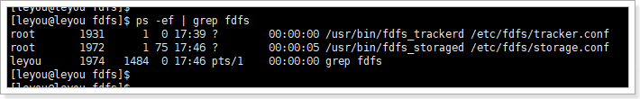

## 1. Centos下安装FastDFS

### 1.1 上传

将课前资料中的文件上传到linux下的`/home/leyou/fdfs`目录:

 


### 1.2 安装依赖

FastDFS运行需要一些依赖，在课前资料提供的虚拟中已经安装好了这些依赖，如果大家想要从头学习，可以按下面方式安装：

#### 1.2.1 安装GCC依赖

GCC用来对C语言代码进行编译运行，使用yum命令安装：

```shell
sudo yum -y install gcc
```

#### 1.2.2 安装unzip工具

unzip工具可以帮我们对压缩包进行解压

```shell
sudo yum install -y unzip zip
```

#### 1.2.3 安装libevent

```shell
sudo yum -y install libevent
```

#### 1.2.4 安装Nginx所需依赖

```shell
sudo yum -y install pcre pcre-devel zlib zlib-devel openssl openssl-devel
```


#### 1.2.5 安装libfastcommon-master

这个没有yum包，只能通过编译安装：

- 解压刚刚上传的`libfastcommon-master.zip`

  ```shell
  unzip libfastcommon-master.zip
  ```

- 删除zip

  ```shell
  rm -rf libfastcommon-master.zip
  ```

- 进入解压完成的目录：

  ```shell
  cd libfastcommon-master
  ```

- 编译并且安装：

  ```shell
  sudo ./make.sh 
  sudo ./make.sh install
  ```

到这里为止，所有依赖都已经安装完毕，接下来我们安装FastDFS：

回到上级目录：

```shell
cd ..
```


### 1.3 安装FastDFS

#### 1.3.1 编译安装

这里我们也采用编译安装，步骤与刚才的编译安装方式一样：

- 解压

  ```shell
  tar -xvf FastDFS_v5.08.tar.gz
  ```

- 进入目录

  ```he
  cd FastDFS
  ```

- 编译并安装

  ```shell
  sudo ./make.sh 
  sudo ./make.sh install
  ```

  **至此，安装完成，tracker和storage都有了。**

  

- 校验安装结果

1）安装完成，我们应该能在`/etc/init.d/`目录，通过命令

```shell
ll /etc/init.d/ | grep fdfs
```

看到FastDFS提供的启动脚本：


其中：

- `fdfs_trackerd` 是tracker启动脚本
- `fdfs_storaged` 是storage启动脚本

`/etc/init.d`目录是系统的启动目录，存放各种脚本，在此目录下的脚本将来可以随着系统自启动。


在启动之前，我们还要先**修改**一下tracker和storage的**配置文件**，因为它里面有写配置需要我们改为我们自己的。

2）我们可以在 `/etc/fdfs`目录，通过命令查看到以下配置文件模板：

```shell
cd /etc/fdfs
ll
```

 

其中：

- `tracker.conf.sample` 是tracker的配置文件模板
- `storage.conf.sample` 是storage的配置文件模板
- `client.conf.sample` 是客户端的配置文件模板


#### 1.3.2 启动tracker

FastDFS的tracker和storage在刚刚的安装过程中，都已经被安装了，因此我们安装这两种角色的方式是一样的。不同的是，两种需要不同的配置文件。

我们要启动tracker，就修改刚刚看到的`tarcker.conf`，并且启动`fdfs_trackerd`脚本即可。


- 但是，目前这三个文件不会被读取到。我们需要将tracker.conf.sample改为tarcker.conf才能被自动读取到。

```shell
mv tracker.conf.sample tracker.conf
```


现在，**tracker.conf就能被自动读取**到了。

- 打开`tracker.conf`，

```shell
vim tracker.conf
```

修改`base_path`配置：

```shell
base_path=/leyou/fdfs/tracker # tracker的数据和日志存放目录
```

保存退出。

- 创建目录

刚刚配置的目录可能不存在，我们创建出来

```shell
sudo mkdir -p /leyou/fdfs/tracker
```

- 启动tracker

  我们可以使用 `sh /etc/init.d/fdfs_trackerd` 启动，不过安装过程中，fdfs已经被设置为系统服务，我们可以采用熟悉的服务启动方式：

```shell
sudo service fdfs_trackerd start # 启动fdfs_trackerd服务，停止用stop
```


另外，我们可以通过以下命令，设置tracker开机启动：

```shell
sudo chkconfig fdfs_trackerd on
```


#### 1.3.3 启动storage

我们要启动tracker，就修改刚刚看到的`tarcker.conf`，并且启动`fdfs_trackerd`脚本即可。


```shell
mv storage.conf.sample storage.conf
```


打开`storage.conf`，

```shell
vim storage.conf
```


修改`base_path`配置：

```shell
base_path=/leyou/fdfs/storage # storage的数据和日志存放目录
store_path0=/leyou/fdfs/storage # storage的上传文件存放路径
tracker_server=192.168.1.205:22122 # tracker的地址
```

最后一个tracker_server：storage启动后要去tracker注册自己，所以要知道tracker的地址，这个地址是虚拟机的ip+tracker的端口。端口默认22122。

保存退出。


- 创建目录

刚刚配置的目录可能不存在，我们创建出来

```shell
sudo mkdir -p /leyou/fdfs/storage
```

- 启动storage

  我们可以使用 `sh /etc/init.d/fdfs_storaged` 启动，同样我们可以用服务启动方式：

```shell
sudo service fdfs_storaged start  # 启动fdfs_storaged服务，停止用stop
```


另外，我们可以通过以下命令，设置storage开机启动：

```shell
sudo chkconfig fdfs_storaged on
```


最后，通过`ps -ef | grep fdfs` 查看进程：



#### 1.3.4 测试文件上传

##### 修改配置

先将client.conf.sample改名。

```shell
mv client.conf.sample client.conf
```


修改客户端配置：

```shell
vim client.conf
```

```shell
base_path=/tmp 
tracker_server=192.168.1.205:22122
```

保存退出。


##### 测试

怎么测试呢？

fastdfs提供了一个上传脚本：`/usr/bin/fdfs_upload_file`，利用这个脚本上传文件。

使用时需要加载客户端配置文件：`/etc/fdfs/client.conf`

还需要制定一个被上传文件：`/tmp/1.jpg` (事先准备好的测试文件)


所以，可执行以下命令上传文件：

```shell
/usr/bin/fdfs_upload_file /etc/fdfs/client.conf /tmp/1.jpg
```

如果当前目录是`/etc/fdfs`，那么可以：

```shell
/usr/bin/fdfs_upload_file client.conf /tmp/1.jpg
```


**上传成功**，并返回结果，文件id：`group1/M00/00/00/wKgBzV1NFI2AbvsXAAehaul-Zzg741.jpg`


##### 返回id解析

`group1/M00/00/00/wKgBzV1NFI2AbvsXAAehaul-Zzg741.jpg`

- group1：组id，找机器。

- M00：代表storage_path0（文件打散），找目录。

>  通过上面两个找到了本机器下的：/leyou/fdfs/storage目录
>
> 此目录有两个目录，data是数据，logs是日志

- 00：一级目录，共有256个目录。
- 00：二级目录，共有256个目录。

- wKgBzV1NFI2AbvsXAAehaul-Zzg741.jpg：文件


### 1.4 安装Nginx及FastDFS模块

> 我们现在通过本机浏览器访问：192.168.1.205/group1/M00/00/00/wKgBzV1NFI2AbvsXAAehaul-Zzg741.jpg
>
> 是访问不到图片的，因为所有请求都被nginx代理了，而且fdfs还未开启http下载配置，要正确处理将指定的请求访问给fdfs，还要做更多一系列复杂的操作。

> 所以FastDFS作者余庆专门又写了一个模块配合nginx使用，

**nginx可以集成各种各样的模块使用**


#### 1.4.1 FastDFS的Nginx模块

> /etc/fdfs是fdfs的配置文件目录

先切换到fdfs目录：

```shell
cd /home/leyou/fdfs
```


- 解压

  ```shell
  tar xvf fastdfs-nginx-module_v1.16.tar.gz
  ```

  删除压缩包
  
  ```shell
  rm -rf fastdfs-nginx-module_v1.16.tar.gz
  ```
  
  
  
  


- 配置config文件

  ```shell
  # 进入配置目录
  cd fastdfs-nginx-module/
  cd src/
  # 修改配置
  vim config
  # 执行下面命令（将配置中的/usr/local改为/usr）：
  :%s+/usr/local/+/usr/+g # 进入config后直接粘贴 %s是全局替换的意思
  ```

  保存退出。

  

- 配置mod_fastdfs.conf

  ```shell
  # 将src目录下的mod_fastdfs.conf复制到 /etc/fdfs目录：
  sudo cp mod_fastdfs.conf /etc/fdfs/
  # 进入fdfs的配置文件夹
  cd /etc/fdfs
  # 编辑该文件
  sudo vim /etc/fdfs/mod_fastdfs.cof
  ```

- 修改一下配置：

  ```shell
  connect_timeout=10                  		# 客户端访问文件连接超时时长（单位：秒）
  tracker_server=192.168.1.205:22122  	# tracker服务IP和端口
  url_have_group_name=true            		# 访问链接前缀加上组名
  store_path0=/leyou/fdfs/storage        		# 文件存储路径
  ```

- 复制 FastDFS的部分配置文件到/etc/fdfs目录

  ```shell
  cd /home/leyou/fdfs/FastDFS/conf/
  cp http.conf mime.types /etc/fdfs/ # 支持http类型的请求访问文件
  ```


至此，所有fastdfs有关的东西已经配置完成。

**接下来是跟fastdfs模块在nginx中的配置，**

**如果你没有安装过nginx，那么你就走1.4.2**

**如果你虚拟机已经安装过了nginx，那么就走1.4.3**

不要两个都走！！！！！！


#### 1.4.2 安装Nginx

- 解压

  ```shell
  tar -xvf nginx-1.10.0.tar.gz
  ```

  

- 配置

  ```shell
  sudo ./configure --prefix=/opt/nginx --sbin-path=/usr/bin/nginx --add-module=/home/leyou/fdfs/fastdfs-nginx-module/src
  ```

  

- 编译安装

  ```shell
  sudo make && sudo make install
  ```

  

- 配置nginx整合fastdfs-module模块

  我们需要修改nginx配置文件，在/opt/nginx/config/nginx.conf文件中：

  ```shell
  sudo vim  /opt/nginx/conf/nginx.conf
  ```

  将文件中，原来的`server 80{ ...}` 部分代码替换为如下代码：

  ```nginx
      server {
          listen       80;
          server_name  image.taotao.com;

      	# 监听域名中带有group的，交给FastDFS模块处理
          location ~/group([0-9])/ {
              ngx_fastdfs_module;
          }

          location / {
              root   html;
              index  index.html index.htm;
          }

          error_page   500 502 503 504  /50x.html;
          location = /50x.html {
              root   html;
          }
          
      }
  ```

- 启动

  ```shell
  nginx # 启动
  nginx -s stop # 停止
  nginx -s reload # 重新加载配置
  ```

- 设置nginx开机启动

  创建一个开机启动的脚本：

  ```shell
  vim /etc/init.d/nginx
  ```

  添加以下内容：

  ```sh
  #!/bin/sh
  #
  # nginx - this script starts and stops the nginx daemon
  #
  # chkconfig:   - 85 15
  # description:  NGINX is an HTTP(S) server, HTTP(S) reverse \
  #               proxy and IMAP/POP3 proxy server
  # processname: nginx
  # config:      /etc/nginx/nginx.conf
  # config:      /etc/sysconfig/nginx
  # pidfile:     /var/run/nginx.pid

  # Source function library.
  . /etc/rc.d/init.d/functions

  # Source networking configuration.
  . /etc/sysconfig/network

  # Check that networking is up.
  [ "$NETWORKING" = "no" ] && exit 0

  # nginx的启动脚本
  nginx="/usr/bin/nginx"
prog=$(basename $nginx)
  
# nginx的配置文件
  NGINX_CONF_FILE="/opt/nginx/conf/nginx.conf"

  [ -f /etc/sysconfig/nginx ] && . /etc/sysconfig/nginx

  lockfile=/var/lock/subsys/nginx
  
  make_dirs() {
     # make required directories
     user=`$nginx -V 2>&1 | grep "configure arguments:.*--user=" | sed 's/[^*]*--user=\([^ ]*\).*/\1/g' -`
     if [ -n "$user" ]; then
        if [ -z "`grep $user /etc/passwd`" ]; then
           useradd -M -s /bin/nologin $user
        fi
        options=`$nginx -V 2>&1 | grep 'configure arguments:'`
        for opt in $options; do
            if [ `echo $opt | grep '.*-temp-path'` ]; then
                value=`echo $opt | cut -d "=" -f 2`
                if [ ! -d "$value" ]; then
                    # echo "creating" $value
                    mkdir -p $value && chown -R $user $value
                fi
            fi
         done
    fi
  }
  
  start() {
      [ -x $nginx ] || exit 5
      [ -f $NGINX_CONF_FILE ] || exit 6
      make_dirs
      echo -n $"Starting $prog: "
      daemon $nginx -c $NGINX_CONF_FILE
      retval=$?
      echo
      [ $retval -eq 0 ] && touch $lockfile
    return $retval
  }
  
  stop() {
      echo -n $"Stopping $prog: "
      killproc $prog -QUIT
      retval=$?
      echo
      [ $retval -eq 0 ] && rm -f $lockfile
    return $retval
  }
  
  restart() {
      configtest || return $?
      stop
      sleep 1
    start
  }
  
  reload() {
      configtest || return $?
      echo -n $"Reloading $prog: "
      killproc $nginx -HUP
      RETVAL=$?
    echo
  }
  
  force_reload() {
    restart
  }
  
  configtest() {
  $nginx -t -c $NGINX_CONF_FILE
  }
  
  rh_status() {
    status $prog
  }
  
  rh_status_q() {
    rh_status >/dev/null 2>&1
  }
  
  case "$1" in
      start)
          rh_status_q && exit 0
          $1
          ;;
      stop)
          rh_status_q || exit 0
          $1
          ;;
      restart|configtest)
          $1
          ;;
      reload)
          rh_status_q || exit 7
          $1
          ;;
      force-reload)
          force_reload
          ;;
      status)
          rh_status
          ;;
      condrestart|try-restart)
          rh_status_q || exit 0
              ;;
      *)
          echo $"Usage: $0 {start|stop|status|restart|condrestart|try-restart|reload|force-reload|configtest}"
        exit 2
  esac
```

保存退出。

如果你需要这份脚本，那么可能你的电脑和我的电脑文件存放路径不同，你需要修改两处东西：

nginx的启动脚本。

nginx的配置文件。

就是上述中文注释标注的地方。（请粘贴时将中文删除）

- 修改文件权限，并加入服务列表

  ```shell
  # 修改权限 755也可以 777也可以
  chmod 777 /etc/init.d/nginx 
  # 添加到服务列表
  chkconfig --add /etc/init.d/nginx 
  ```

- 设置开机启动

  ```shell
  chkconfig nginx on
  ```

  完成。
  
  

#### 1.4.3 nginx中fastdfs模块的配置

##### 1.4.3.1 重新配置

- 进入nginx：

```shell
cd /home/leyou/nginx-1.10.0/
```


- 重新进行**配置**：

```shell
./configure --prefix=/opt/nginx --sbin-path=/usr/bin/nginx --add-module=/home/leyou/fdfs/fastdfs-nginx-module/src
```

安装过nginx的同学都知道，我们安装nginx时，是先解压，再配置，再编译安装，配置时，运行：

```shell
./configure --prefix=/opt/nginx --sbin-path=/usr/bin/nginx
```

这里比之前多了`--add-module=/home/leyou/fdfs/fastdfs-nginx-module/src`，就是添加了fastdfs模块。

`/home/leyou/fdfs/fastdfs-nginx-module/src`是刚才fastdfs解压后的包里的src目录。


成功：


##### 1.4.3.2 重新编译nginx

- 编译：（只编译make，**不安装**make install！）

```shell
make
```


成功。


编译成功后，会在**当前目录下**的**objs目录**里看到一个新的`nginx`脚本

```shell
cd objs
```


之前的nginx脚本在：`/usr/bin/nginx`。

##### 1.4.3.3 覆盖nginx启动脚本

这里我们先

- 备份之前的nginx脚本

  ```shell
  mv /usr/bin/nginx /usr/bin/nginx-bck
  ```

  再

- 用刚才编译的nginx脚本替换之前安装的nginx脚本

  ```shell
  cp /home/leyou/nginx-1.10.0/objs/nginx /usr/bin
  ```

正常情况下这里会问你是否overwrite覆盖原文件，我们选y

(

如果你没有出现选择，很可能是没有覆盖成功，没有成功的原因可能因为你没有停掉nginx，nginx还在运行，所以可以先停掉nginx

```shell
nginx -s stop
```

再执行覆盖

```shell
cp /home/leyou/nginx-1.10.0/objs/nginx /usr/bin
```

)


##### 1.4.3.4 配置nginx.conf

接下来我们要修改nginx的配置文件，添加一条fastdfs的拦截转发映射规则。

可以在FTP工具里修改。


修改nginx.conf文件（在/opt/nginx/conf目录下），添加以下内容：(最好将中文删除掉)

```conf
 server {
        listen       80;
        server_name  image.leyou.com;

    	# 正则表达式 监听域名中带有group的，交给FastDFS模块处理
        location ~/group([0-9])/ {
            ngx_fastdfs_module;
        }
		# 下面这两个配不配都行
        location / {
            root   html;
            index  index.html index.htm;
        }

        error_page   500 502 503 504  /50x.html;
        location = /50x.html {
            root   html;
        }
        
    }
```

##### 1.4.3.5 配置hosts

在本机hosts文件（在C:\Windows\System32\drivers\etc）里添加一条：

```
192.168.1.205 image.leyou.com
```


##### 1.4.3.6 启动nginx

启动nginx：

```shell
nginx
```

启动成功：


如果你看得到ngx_http_fastdfs这句话，那么说明你的fastdfs模块安装成功了。


##### 1.4.3.7 本机访问图片

在本机浏览器访问图片：（域名+图片id）

http://image.leyou.com/group1/M00/00/00/wKgBzV1NFI2AbvsXAAehaul-Zzg741.jpg

访问成功：


##### 1.4.3.8 设置nginx开机启动

见 1.4.2中的设置nginx开机启动。